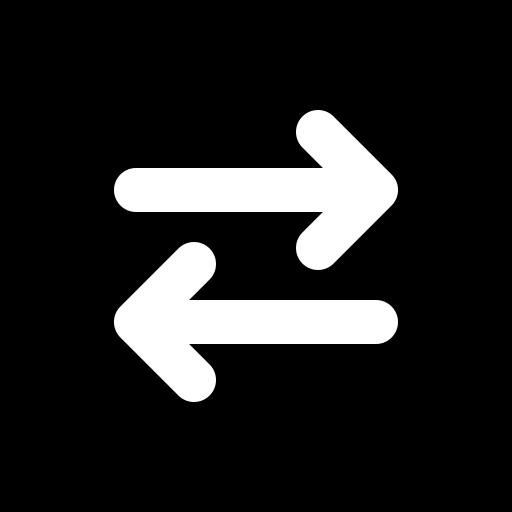

<p align="center">
  
</p>

# BrowserSync

BrowserSync is a Manifest V3 Chromium extension that mirrors open HTTP/HTTPS tabs
and, optionally, all bookmarks and visited HTTP/HTTPS addresses between browser
installations. Synchronization data is stored in the signed-in
user's hidden Google Drive `appDataFolder`; no application backend is required.

## Current MVP

- portable Google OAuth through `chrome.identity.launchWebAuthFlow`
- race-free immutable operation batches in Google Drive
- incremental polling through the Drive Changes API
- local durable state and outbox in IndexedDB
- create, navigate, close, pin and unpin synchronization
- one-switch synchronization of the complete bookmarks tree
- one-switch synchronization of new HTTP/HTTPS addresses visited after opt-in
- deterministic last-write-wins conflict resolution with tombstones
- automatic polling every 30 seconds

Incognito tabs, browser-internal pages, extension pages and `file://` URLs are
not synchronized. Window layout, tab groups and active tab are not part of the
MVP. Tab ordering across multiple windows is intentionally not
synchronized yet because Chromium indexes are scoped to a window rather than a
browser profile.

Chromium only allows extensions to add a history URL at the current time. The
original visit timestamps, titles, transition types and visit counts therefore
cannot be reproduced on another installation. Existing local history is never
uploaded or replaced when history synchronization is enabled; only subsequent
visits and explicit removals are propagated.

## Google Cloud setup

1. Create a project in Google Cloud Console.
2. Enable **Google Drive API**.
3. Configure the OAuth consent screen.
4. For unpacked builds on multiple computers, generate one development key:

   ```bash
   openssl genrsa -out browsersync-dev.pem 2048
   openssl rsa -in browsersync-dev.pem -pubout -outform DER | openssl base64 -A
   ```

5. Copy `.env.example` to `.env` and put the command output into
   `WXT_EXTENSION_PUBLIC_KEY`. Keep `browsersync-dev.pem` private and never commit it.
6. Run `npm install` and `npm run build`.
7. Load `.output/chrome-mv3` as an unpacked extension at `chrome://extensions`.
8. Copy the generated extension ID.
9. Create an OAuth client of type **Web application** and add this exact
   authorized redirect URI:

   ```text
   https://<EXTENSION_ID>.chromiumapp.org/oauth2
   ```

10. Set that web client ID as `WXT_GOOGLE_CLIENT_ID` in `.env`, then rebuild and
    reload the extension.

Use the same public extension key and OAuth client ID on the second machine. A
Chrome Web Store release already has a stable extension ID and does not need the
development-key workaround.

Interactive OAuth must be initiated from the popup. The extension requests only
the `drive.appdata` scope and cannot access normal files in the user's Drive.
The Web application client is required for Helium, Brave, Edge and other
Chromium builds where Chrome's profile-bound `getAuthToken()` is unavailable.

## Development

```bash
npm install
npm run dev
```

Checks:

```bash
npm run check
```

## First-device behavior

If no cloud operations exist, the first enabled installation publishes its
current supported tabs. A later installation downloads that canonical set and,
after the user presses **Enable synchronization**, replaces its local supported
tabs. Unsupported and incognito tabs are left untouched.

The current journal format favors correctness under concurrent writers. Journal
compaction and cloud reset controls are planned after validating the end-to-end
flow with two Chrome profiles.
